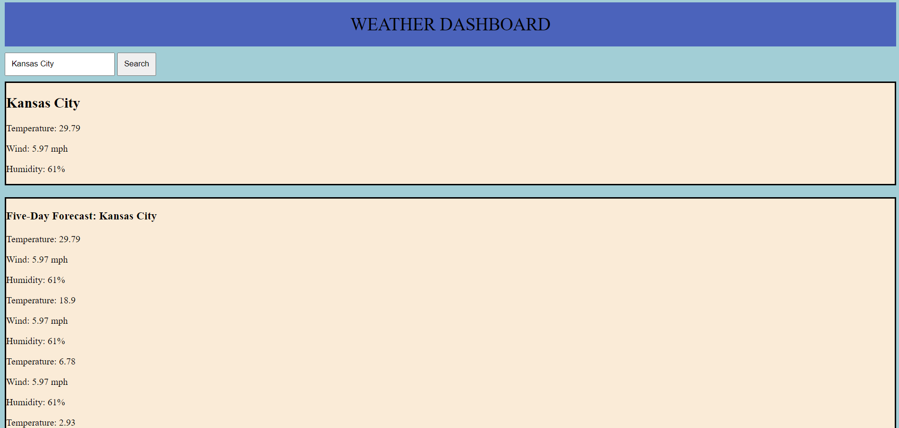

# weather-dashboard

## Description
This application is a weather dashboard that displays the current temperature, wind speed, and humidity in a searched city as well as the temperature, wind speed, and humidity for the next five consecutive days.

## Installation

N/A

## Usage
In the search bar on the application, type in a city and click on the "Search" button. The city and its temperature, wind speed, and humidity will display once the user presses enter at the top. 

The weather for the next five days in the same city, will display below in order or date under the header of "Five-day Forecast". The weather information displayed includes the temperature, wind speed, and humidity for each day. 

Dev tools can be used by right clicking on the deployed wepage and clicking inspect. This will show the console to the right. 

## Deployed Link

Deployed Link: https://vdusin.github.io/weather-dashboard/

## Credits

I worked on this project with the help of a KU Tutor.

## License

Please refer to the license in the repo.